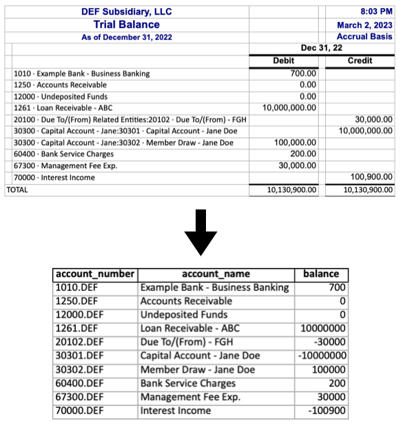

# Trial-Balance-Formatting
Example notebook for preparing QuickBooks trial balance data for import into CCH Engagement
---

#### *** while this project was inspired by a real-world scenario, all data in this project is purely fictitious ***
---
## Overview
Formatting trial balance data from quickbooks exports to import into CCH Engagement can be tedious work, especially for clients with multiple related entities. While it is manageable  to handle this work in excel for companies with 3 or 4 subsidiaries, what if there are dozens? And what if each entity has hundreds of accounts?

This repository was inspired by a real world scenario working in an audit and assurance practice where I was asked to format the trial balances for a company with almost 100 subsidiaries. I decided it was time to put together a scalable ETL workflow for trial balance data using python to automate process from start to finish. 

The notebooks in this project assume some basic knowledge of python inlcuding data types, control flow, functions, and the pandas library. If you would like to jump straight into the code, check out the [example notebook](example_notebook_tb_formatting.ipynb) or the corresponding [etl script](trial_balance_etl.py) (the two are essentially identical). If you would like a more step by step guide that lays out the thought processes behind each step, check out the [tutorial notebook](tutorial_notebook_tb_formatting.ipynb). 

If you're new to python but curious to learn more about pythonic approaches to accounting workflows, feel free to reach out on [LinkedIn](linkedin.com/in/jacxson). I'd love to chat!

